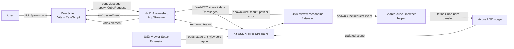

# Omniverse Scene Control Architecture

## Purpose

This project connects a React web client to a running NVIDIA Omniverse Kit USD
Viewer. The browser displays the Kit viewport as a WebRTC video stream and
offers a **Spawn cube** control. Pressing the control sends a command through
the stream's data channel; Kit authors the cube into the currently open USD
stage and sends the created prim path back to the browser.

The React application is a control surface for Kit, not a second scene
renderer. USD remains authoritative on the Kit side.

## System context



### Runtime components

| Component | Location | Responsibility |
|---|---|---|
| React entry point | `src/main.tsx` | Finds the page root and mounts the React application. |
| React application | `src/App.tsx` | Builds the control panel, connects the WebRTC client, renders stream/status state, sends spawn requests, and processes Kit results. |
| Page shell | `index.html` | Supplies the root element, metadata, and application entry module. |
| Client styling | `src/index.css` | Styles the React control surface, status feedback, and video frame. |
| WebRTC SDK | `@nvidia/ov-web-rtc` | Negotiates a direct Kit stream, attaches media to the video/audio elements, and transports application messages. |
| Streaming application layer | `source/apps/my_company.my_usd_viewer_streaming.kit` | Extends the base Viewer application with Kit app streaming dependencies and settings. |
| Base Viewer application | `source/apps/my_company.my_usd_viewer.kit` | Defines the Viewer application and includes the local cube extension dependency. |
| Viewer setup extension | `my_company.my_usd_viewer_setup_extension` | Loads the configured USD stage, sets default stage lighting (`DomeLight` and `DistantLight`), and loads the Viewer layout. |
| Messaging extension | `my_company.my_usd_viewer_messaging_extension` | Bridges WebRTC custom messages to Kit event-dispatcher handlers and registers response events. |
| Cube UI extension | `my_company.my_python_ui_extension` | Provides the in-Kit sample window and declares the shared cube helper dependency. |
| Shared cube helper | `my_company.my_python_ui_extension.cube_spawner` | Creates unique, grounded cubes in a supplied USD stage. Both the local UI and the streamed message path use it. |

### Dependency direction

The intended dependency chain is:

```text
my_company.my_usd_viewer_streaming.kit
└── my_company.my_usd_viewer.kit
    ├── my_company.my_python_ui_extension
    └── my_company.my_usd_viewer_setup_extension
        └── my_company.my_usd_viewer_messaging_extension
            └── my_company.my_python_ui_extension
```

The streaming layer inherits the base Viewer dependencies and adds
`omni.kit.livestream.app`. The messaging extension also depends directly on
the cube extension because it calls the shared helper. Kit discovers these
local packages through the app's configured extension folders; `repo.bat
build` stages them under `_build/windows-x86_64/release/`.

## Spawn-cube message contract

The protocol uses named custom application messages over the existing Kit
stream. The browser and Kit must use the same event names and payload shapes.

### Request

```json
{
  "event_type": "spawnCubeRequest",
  "payload": {}
}
```

No client-supplied prim path, position, or USD code is accepted. Kit chooses
the prim name and transform.

### Success response

```json
{
  "event_type": "spawnCubeResult",
  "payload": {
    "result": "success",
    "path": "/World/Cube"
  }
}
```

Subsequent requests use the first unused path (`/World/Cube_1`,
`/World/Cube_2`, and so on).

### Error response

```json
{
  "event_type": "spawnCubeResult",
  "payload": {
    "result": "error",
    "error": "No USD stage is open"
  }
}
```

Unexpected USD authoring exceptions are logged in the Kit process with their
traceback. The browser receives a generic error instead of internal details.

`spawnCubeRequest` and `spawnCubeResult` are application messages (identified
by `event_type`). They are not HTTP endpoints and do not use `fetch` or a
separate REST service.

## Request and response sequence

```mermaid
sequenceDiagram
    actor User
    participant UI as React App
    participant SDK as AppStreamer
    participant Stream as Kit WebRTC stream
    participant Bridge as Messaging extension
    participant USD as Active USD stage

    User->>UI: Click Spawn cube
    UI->>UI: Disable button; start 10 s result timer
    UI->>SDK: sendMessage({event_type, payload})
    SDK->>Stream: Send custom application message
    Stream->>Bridge: Dispatch spawnCubeRequest event
    Bridge->>USD: Call shared spawn_cube(stage)
    USD-->>Bridge: Created prim path (or failure)
    Bridge->>Stream: Dispatch spawnCubeResult event
    Stream-->>SDK: Deliver custom response
    SDK-->>UI: onCustomEvent(spawnCubeResult)
    UI->>UI: Clear timer; show path or error; enable button
    USD-->>Stream: Updated rendered viewport frames
    Stream-->>UI: WebRTC video
```

The SDK's `sendMessage` promise reports the send operation. The separate
`spawnCubeResult` custom event reports the Kit-side result. The React client
uses both: a send failure is shown immediately, while a successfully sent
request remains pending until its result arrives or its 10-second timeout
expires.

## Cube authoring behavior

`cube_spawner.spawn_cube(stage)` is the single source of truth for cube
creation:

1. Create `/World` as an Xform if the stage does not already contain it.
2. Find the first unused `/World/Cube*` prim path.
3. Define a default USD cube at that path.
4. Read the stage's up axis and set the cube center to half its size (100.0 units) along that
   axis. This places the bottom face at ground height zero for Y-up and Z-up
   stages.
5. Move each later cube 150.0 stage units farther along X.
6. Manually adjust the active viewport camera's translation and rotation via the USD Xform API to instantly face the new cube.
7. Wrap the entire authoring operation in `Sdf.ChangeBlock()` so all prim, attribute, and camera changes coalesce into a single stage notice, preventing Hydra from repeatedly refitting acceleration structures (BVH) and stalling the renderer.
8. Return the authored prim path.

The operation changes the active in-memory USD stage. It does not save the
stage to disk. Save/persistence is a separate authoring action.

The Kit extension's own **Spawn Cube** button and the React control both call
this helper. The in-Kit button is useful for local testing, but it is not the
browser-to-Kit communication path.

## Connection and UI state

The React application maintains:

- `connection`: `connecting`, `connected`, or `error`.
- `connectionMessage`: human-readable transport status.
- `isSpawning`: prevents duplicate clicks while a request is pending.
- `commandMessage`: send, result, or timeout feedback.
- `isStreamStalled`: WebRTC frame watchdog status detecting frozen decoded frames.

On mount, `App.tsx` creates an `AppStreamer` instance (cached via `useMemo` to prevent redundant network reconnections on render) and calls `connect` with a direct
stream configuration. The video and audio element IDs connect the SDK to
`index.html`. Resolution and frame-rate requests are set to 1920×1080 and 60
FPS with explicit `VideoCodec.H264` pinning and run-loop rate-limiting on the Kit server to eliminate frame pacing jitter and encoder freezes. The signaling host defaults to the browser page's hostname. A different
Kit host can be provided with a URL such as
`http://localhost:5173/?server=192.168.1.20`.

On unmount, the React effect clears a pending result timer and terminates the
streamer instance. A `--no-window` Kit launch hides Kit's local desktop
window; it does not hide the stream from this React page.

## Startup and local development

Run the Kit streaming application and Vite development server as separate
processes. From `D:\Omniverse_learning\kit-app-template`, build after changing
Kit files, then launch the built streaming layer with the target stage:

```powershell
.\repo.bat build
& ".\_build\windows-x86_64\release\kit\kit.exe" `
  ".\_build\windows-x86_64\release\apps\my_company.my_usd_viewer_streaming.kit" `
  --no-window `
  "--/app/auto_load_usd=D:\Omniverse_learning\Factory_Lite\Factory_Lite.usd"
```

In another PowerShell window:

```powershell
cd D:\Omniverse_learning\Poc_test
npm install
npm run dev -- --host 127.0.0.1
```

Open `http://127.0.0.1:5173` in Chromium. Wait for **Connected to Kit**, click
**Spawn cube**, and expect a result such as `Cube created at /World/Cube`.
Keep both the Kit process and the React development server running for the
duration of the test.

The streaming host and browser must be able to reach the Kit signaling service
and establish the WebRTC media/data connection. Setting `?server=` only
chooses the signaling hostname; it does not configure firewalls, advertise
public addresses, or provide TURN relays.

## Failure handling and diagnostics

| Symptom | Likely layer | First checks |
|---|---|---|
| Browser remains “Connecting to Kit” | Signaling/network | Confirm Kit is running the built `my_company.my_usd_viewer_streaming.kit`; use the reachable Kit host in `?server=`; check firewall and signaling errors in Kit and browser consoles. |
| Stream connects but request times out | Data messaging | Check the Kit log for messaging-extension startup and `spawnCubeRequest` errors; verify both processes were rebuilt/restarted after Kit source changes. |
| Browser shows a Kit error result | USD operation | Confirm a stage is open; inspect Kit logs for the server-side spawn traceback. |
| Browser reports a path but cube is not visible | View/rendering | Confirm the same stage is displayed in the stream and inspect the stage for the returned prim path. The helper authors the cube in the active stage but does not save it. |
| “Connected to Kit” but black viewport | Rendering/media | Check Kit viewport, renderer/GPU startup, browser WebRTC media status, and console output independently of the data-channel command. |

Avoid adding a second message bridge or HTTP API for this operation. Use the
existing stream messaging extension for Kit commands and keep message payloads
minimal and explicitly validated server-side.

## Verification

The implementation has been validated with:

- React TypeScript typecheck, production build, formatting check, and smoke
  test.
- Kit release build.
- Python UI extension test for cube placement and unique names.
- Messaging extension test for the `spawnCubeRequest` handler, returned paths,
  ground placement, and spacing.
- A live local browser-to-Kit WebRTC test; clicking the React control returned
  `Cube created at /World/Cube`.

The production Vite build currently emits a large-bundle advisory because the
WebRTC SDK is included in the client bundle. This is a size warning, not a
build failure.
