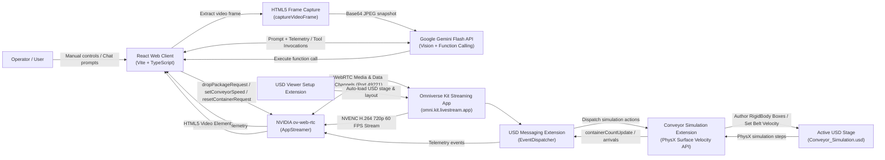

# Omniverse Digital Twin Conveyor & Scene Control Architecture

## Purpose

This project connects an interactive React industrial digital twin dashboard to a running NVIDIA Omniverse Kit USD PhysX simulation. The browser displays the Kit viewport as a real-time, low-latency WebRTC video stream and provides bidirectional logistics controls (**Drop Package**, **Conveyor Velocity**, **Empty Bin**, **Auto-Cycle**) alongside an autonomous **Multimodal AI Industrial Copilot** powered by Google Gemini Flash.

Operators can interact with the simulation in two complementary ways:
1. **Direct Operator Control**: Manual triggers via the glassmorphism dashboard send custom application commands over the WebRTC bidirectional data channel. Kit dynamically authors rigid body package prims or adjusts PhysX surface velocity directly on the live USD stage, streaming physics arrivals and telemetry back to the client.
2. **Autonomous AI Copilot Control**: The integrated Gemini Flash Copilot captures live video snapshots from the WebRTC stream via an HTML5 canvas bridge, inspects the intake drop zone for physical clearance or bottlenecks, and invokes registered simulation tools (`drop_package`, `set_conveyor_speed`, `empty_container`, `toggle_auto_cycle`, `get_telemetry`) via structured function calling.

USD and PhysX remain fully authoritative on the Omniverse Kit host; the React application serves as a high-performance control, observability, and AI orchestration surface.

---

## System Context



---

### Runtime Components

| Component | Path | Responsibility |
|---|---|---|
| **React Entry Point** | [`Poc_test/src/main.tsx`](file:///d:/Omniverse_learning/Poc_test/src/main.tsx) | Mounts the React application tree to the DOM root. |
| **Main Dashboard Application** | [`Poc_test/src/App.tsx`](file:///d:/Omniverse_learning/Poc_test/src/App.tsx) | Coordinates WebRTC streaming connection, video element mounting, logistics control actions, real-time telemetry counters, and AI Copilot drawer integration. |
| **AI Copilot Service** | [`Poc_test/src/services/geminiService.ts`](file:///d:/Omniverse_learning/Poc_test/src/services/geminiService.ts) | Houses Gemini Flash API communication, function-calling tool declarations (`GEMINI_TOOLS`), canvas-based WebRTC frame snapshot capture, candidate model catalog discovery, and autonomous visual dispatch decision logic. |
| **AI Assistant UI** | [`Poc_test/src/components/AIAssistant.tsx`](file:///d:/Omniverse_learning/Poc_test/src/components/AIAssistant.tsx) | Collapsible slide-out industrial Copilot dock supporting natural-language chat, quick tool action chips, camera vision snapshots, and tool-execution status feedback. |
| **API Key Management** | [`Poc_test/src/components/ApiKeyModal.tsx`](file:///d:/Omniverse_learning/Poc_test/src/components/ApiKeyModal.tsx) | Client-side modal for configuring Google AI API keys with live validation against Google endpoints, model catalog resolution, and local storage persistence. |
| **Client Design System** | [`Poc_test/src/index.css`](file:///d:/Omniverse_learning/Poc_test/src/index.css) | Custom glassmorphism UI tokens, industrial status badges, responsive viewport pinning, and micro-animations. |
| **WebRTC SDK** | `@nvidia/ov-web-rtc` | Manages WebRTC signaling, peer connection lifecycle, H.264 media decoding, and bidirectional custom data channel messages. |
| **Kit Streaming Application** | [`kit-app-template/source/apps/my_company.my_usd_viewer_streaming.kit`](file:///d:/Omniverse_learning/kit-app-template/source/apps/my_company.my_usd_viewer_streaming.kit) | Configures Kit livestreaming with NVENC hardware encoding, run-loop rate limiting (60 FPS), and disabled dynamic resizing for rock-solid video stability. |
| **USD Viewer Setup Extension** | `my_company.my_usd_viewer_setup_extension` | Automatically opens configured USD stages (`Conveyor_Simulation.usd`), sets camera angles, and initializes lighting. |
| **USD Viewer Messaging Extension** | `my_company.my_usd_viewer_messaging_extension` | Listens to WebRTC data channel events, triggers local Kit actions via event dispatchers, and pushes telemetry responses back across the stream. |
| **Conveyor Simulation Extension** | `my_company.my_python_ui_extension` | Drives PhysX conveyor surface velocity, spawns dynamic rigid body packages, executes package arrival tracking, and manages automated viewport camera framing. |
| **USD Digital Twin Stage** | [`Conveyor_Simulation.usd`](file:///d:/Omniverse_learning/Conveyor_Simulation.usd) / [`.usda`](file:///d:/Omniverse_learning/Conveyor_Simulation.usda) | Authoritative USD stage containing the SimReady conveyor belt assembly, structural framing, guide rails, intake chute, drop camera, and collection bin. |

---

### Dependency Hierarchy

```text
kit-app-template/source/apps/my_company.my_usd_viewer_streaming.kit
└── my_company.my_usd_viewer.kit
    ├── omni.kit.livestream.app (NVIDIA WebRTC Livestreaming)
    ├── my_company.my_python_ui_extension (Conveyor Physics & Package Lifecycle)
    └── my_company.my_usd_viewer_setup_extension (Stage Loading & Viewport Setup)
        └── my_company.my_usd_viewer_messaging_extension (WebRTC Custom Message Bridge)
            └── my_company.my_python_ui_extension (Conveyor Simulation APIs)
```

The streaming application inherits all foundational Viewer features and layers `omni.kit.livestream.app` on top. When built via `repo.bat build`, Kit packages all extension artifacts into `_build/windows-x86_64/release/`.

---

## AI Copilot & Multimodal Vision Workflow

```mermaid
sequenceDiagram
    actor Operator
    participant UI as React App / Copilot
    participant Canvas as Video Frame Capture
    participant Gemini as Google Gemini Flash
    participant Stream as ov-web-rtc Data Channel
    participant Kit as Kit PhysX Engine

    Operator->>UI: "Inspect intake and drop a box if clear"
    UI->>Canvas: captureVideoFrame('remote-video')
    Canvas-->>UI: base64 JPEG snapshot (0.85 quality)
    UI->>Gemini: generateContent(prompt, imageSnapshot, tools, telemetry)
    Note over Gemini: Gemini inspects image & intake chute clearance
    Gemini-->>UI: Function Call: drop_package()
    UI->>Stream: sendMessage({ event_type: "dropPackageRequest", payload: {} })
    Stream->>Kit: Author package prim on USD stage
    Kit-->>Stream: dropPackageResult: success
    Stream-->>UI: Custom event confirmation
    UI->>Gemini: Return tool execution result ("Dispatched package onto conveyor")
    Gemini-->>UI: "Intake area was clear; package dispatched successfully."
    UI-->>Operator: Render assistant message & green action badge
```

### 1. Multimodal Frame Capture Bridge
- The client samples the active HTML5 `<video id="remote-video">` rendered by `@nvidia/ov-web-rtc`.
- The offscreen `HTMLCanvasElement` captures the current hardware-decoded video buffer at native stream resolution ($1280 \times 720$).
- Output is compressed to a base64 JPEG (`image/jpeg`, 0.85 quality) and injected into Gemini's `inline_data` content part.

### 2. Tool Calling Protocol (`GEMINI_TOOLS`)
The AI model is equipped with declared function definitions:
- **`drop_package`**: Spawns a new parcel at the intake chute.
- **`set_conveyor_speed`**: Dynamically adjusts belt surface speed in mm/s (range: 50–300 mm/s).
- **`empty_container`**: Resets delivered packages and clears container inventory.
- **`toggle_auto_cycle`**: Starts or halts periodic autonomous dispatching.
- **`get_telemetry`**: Retrieves live operational metrics (in-transit counts, container totals, belt velocity, streaming FPS).

### 3. Autonomous Visual Dispatch Decision Engine
In addition to ad-hoc conversational queries, the client supports one-touch autonomous evaluation:
- Invokes `evaluateAndDispatchPackage()` with current telemetry and live camera snapshots.
- If the intake zone is clear of preceding packages and no jam is detected, Gemini executes `drop_package`.
- If a prior package remains under the intake or the container is overloaded (> 20 boxes), Gemini withholds dispatch and provides a clear operational justification (e.g., *"Holding dispatch: Preceding parcel has not cleared the intake threshold"*).

---

## WebRTC Message Contract

Commands and telemetry travel through named JSON messages over the WebRTC data channel:

### 1. Drop Package Request (`dropPackageRequest`)
- **Direction**: Browser $\to$ Kit
- **Payload**: `{}`
- **Action**: Kit spawns a rigid body box at the intake chute $(X = -310, Y = 155, Z = 1.4)$ configured with `PhysicsRigidBodyAPI`, `PhysicsCollisionAPI`, and `MassAPI` (2.5 kg).
- **Response**: `dropPackageResult` with `{ "result": "success", "path": "/World/Packages/Package_N" }`.

### 2. Set Conveyor Speed (`setConveyorSpeed`)
- **Direction**: Browser $\to$ Kit
- **Payload**: `{ "speed": 140.0 }`
- **Action**: Dynamically updates the `PhysxSurfaceVelocityAPI` on the belt mesh (`SM_ConveyorBelt_A06_Belt_01`) to `(0.0, -speed, 0.0)`.

### 3. Reset Container / Clear Bin (`resetContainerRequest`)
- **Direction**: Browser $\to$ Kit
- **Payload**: `{}`
- **Action**: Iterates through delivered packages under `/World/Packages`, removes USD prims from the stage, and resets the delivered counter to 0.

### 4. Telemetry Broadcast (`containerCountUpdate`)
- **Direction**: Kit $\to$ Browser
- **Payload**: `{ "count": N, "last_package": "/World/Packages/Package_N" }`
- **Action**: Broadcast every time a parcel arrives at the collection bin boundary ($X \ge 340, Y \le 105$).

---

## Conveyor Physics & Viewport Camera Framing

`conveyor_simulation.py` manages all USD and PhysX scene configurations:

1. **SimReady Belt Surface Velocity**:
   - Identifies `/World/ConveyorBelt_A06_PR_NVD_01/Geometry/SM_ConveyorBelt_A06_Belt_01` and applies `PhysxSurfaceVelocityAPI`.
   - The belt mesh's local coordinate system aligns with world coordinates such that local velocity `(0.0, -speed, 0.0)` drives rigid bodies smoothly down the length of the belt in world $+X$.
2. **Collision Meshes**:
   - Guide rails, support frames, and the collection bin receive `CollisionAPI` to ensure dynamic parcels stay centered and settle neatly in the bin upon discharge.
3. **Optimized Camera Viewport Framing**:
   - Viewport camera framing (`frame_conveyor_camera`) centers the camera at:
     - **Y-Up**: Position $(50, 270, 520)$ with rotation $(-25^\circ, 0^\circ, 0^\circ)$.
     - **Z-Up**: Position $(50, -520, 270)$ with rotation $(65^\circ, 0^\circ, 0^\circ)$.
   - This angle frames the complete operational envelope from the intake drop zone ($X \approx -370$) along the entire belt span to the collection container ($X = +416$).

---

## Anti-Freeze & Performance Architecture

Production streaming stability is achieved through multi-layer tuning:

1. **Hardware H.264 Codec Pinning**: The client enforces `VideoCodec.H264` and `codecList: ['H264']` to prevent browsers from negotiating CPU-heavy VP8/VP9 codecs that cause keyframe decode freezes.
2. **Kit Run-Loop Rate Limiting**: The Kit streaming process is locked to 60 FPS (`rateLimitEnabled = true`, `rateLimitFrequency = 60`), preventing NVENC buffer underruns and GPU starvation.
3. **Decoded Frame Watchdog**: A background interval evaluates `videoElement.getVideoPlaybackQuality().totalVideoFrames`. If frame progression halts while connection remains active, the UI flags a stall state.
4. **Layout Thrash Prevention**: The WebRTC `<video>` element is pinned using CSS `position: absolute; inset: 0; object-fit: contain;`, preventing DOM reflow calculations during video decoding.

---

## Operational Scripts & Workflow

To streamline development and demonstration, the repository provides three one-click batch scripts:

```text
d:\Omniverse_learning\
├── start_streaming_server.bat   # Builds & starts Kit streaming server (Port 49221)
├── start_web_client.bat        # Installs deps & launches Vite development server (Port 5173)
└── stop_all.bat                # Cleanly terminates kit.exe and frees port 5173
```

### 1. Launching the Streaming Server (`start_streaming_server.bat`)
- Validates the presence of `_build/windows-x86_64/release/kit/kit.exe` (running `repo.bat build` automatically if absent).
- Launches Kit in headless streaming mode (`--no-window`) with resolution locked to $1280 \times 720$.
- Starts the WebRTC signaling service on TCP port **49221**.

### 2. Launching the Web Client (`start_web_client.bat`)
- Installs npm dependencies under `Poc_test/` if `node_modules` is missing.
- Launches Vite with `--host 0.0.0.0` to permit access across local networks (e.g. mobile devices, tablets).
- Connects automatically to `http://127.0.0.1:5173/` or allows overriding target server via `?server=<KIT_HOST_IP>`.

### 3. Clean Shutdown (`stop_all.bat`)
- Forcefully terminates all running `kit.exe` processes.
- Scans and terminates any lingering processes bound to listening port **5173**.

---

## Troubleshooting & Diagnostics

| Symptom | Layer | Root Cause & Resolution |
|---|---|---|
| **Browser stuck on "Connecting to Kit"** | Signaling / Network | Verify `start_streaming_server.bat` is running; confirm port `49221` is unblocked in Windows Firewall; if connecting from a remote device, supply `?server=<HOST_IP>`. |
| **Connected to Kit but black viewport** | NVENC / Display Driver | Verify NVIDIA RTX GPU drivers are up to date. Ensure GPU hardware encoding is available and no other app is monopolizing NVENC sessions. |
| **Commands timeout without response** | Messaging Extension | Check Kit log files in `kit-app-template/data/logs/` for messaging extension initialization errors or stage prim path mismatches. |
| **Packages slide off conveyor** | PhysX Surface Velocity | Verify belt velocity vector matches `(0.0, -speed, 0.0)` in local mesh space and that guide rails retain active collision bindings. |
| **Gemini AI fails with API error** | AI Service | Click the AI Copilot settings gear, confirm your Google AI Studio API key, and test connectivity. Verify your quota or candidate model availability. |
