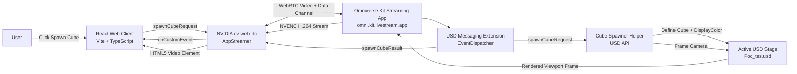

# Omniverse Web Streaming (Bidirectional WebRTC)

A real-time, low-latency bidirectional WebRTC streaming architecture connecting a **React web client** to an **NVIDIA Omniverse Kit USD Viewer**.

The browser displays the Omniverse Kit viewport as an interactive WebRTC video stream and provides an action rail to author USD primitives dynamically. Commands travel bidirectionally across the WebRTC data channel, triggering server-side USD stage changes that immediately reflect in the streamed viewport.

---

## Architecture Overview



### Components

| Component | Path | Description |
| :--- | :--- | :--- |
| **React Web Client** | `Poc_test/` | Modern React UI powered by Vite, TypeScript, and `@nvidia/ov-web-rtc`. |
| **Streaming App** | `kit-app-template/source/apps/my_company.my_usd_viewer_streaming.kit` | Kit application configured with WebRTC livestreaming, NVENC H.264 encoding, and run-loop rate-limiting. |
| **Messaging Extension** | `kit-app-template/source/extensions/my_company.my_usd_viewer_messaging_extension` | Bridges WebRTC custom messages to Kit's event dispatcher. |
| **Cube Spawner Extension** | `kit-app-template/source/extensions/my_company.my_python_ui_extension` | Authors colored cubes side by side and dynamically adjusts camera framing. |
| **Viewer Setup Extension** | `kit-app-template/source/extensions/my_company.my_usd_viewer_setup_extension` | Loads USD stages and sets up default lighting and layout. |
| **USD Demo Stage** | `Poc_tes.usd` | Sample USD stage configured for the streaming viewport. |

---

## Anti-Freeze & Performance Optimizations

This project incorporates production-grade performance tuning based on official NVIDIA Omniverse development guidelines:

1. **Hardware H.264 Codec Pinning**: Client enforces explicit `VideoCodec.H264` and `codecList: ['H264']` to prevent browser fallback to software decoders (VP8/VP9) and keyframe stalls.
2. **Kit Run-Loop Rate Limiting**: Server run-loop is rate-limited (`rateLimitEnabled = true`, `rateLimitFrequency = 60`) to eliminate frame-pacing jitter and NVENC encoder starvation.
3. **Livestream Core Tuning**: Bitrate capped at 10 Mbps (`videoBitrate = 10000000`, `videoFps = 60`) to prevent UDP packet drop bursts on port `48021`.
4. **Dynamic Side-by-Side Placement & Camera Framing**: Cubes are spaced 130 units apart along the horizontal axis with alternating vibrant colors; camera centers on the row's midpoint and pulls back smoothly so all cubes remain framed side by side.
5. **Decoded Frame Watchdog**: WebRTC client continuously verifies `getVideoPlaybackQuality().totalVideoFrames` to detect and surface decode freezes.
6. **Pinned Video Layout**: Viewport CSS uses `position: absolute; inset: 0; object-fit: contain;` to avoid layout reflow thrashing during 60 FPS hardware video decoding.

---

## Prerequisites

- **OS**: Windows 10 / 11 (64-bit)
- **GPU**: NVIDIA RTX GPU with up-to-date Game Ready or Studio Drivers
- **Node.js**: v18.0 or newer
- **Omniverse Kit SDK**: 110.3+ (installed automatically via `kit-app-template`)

---

## Getting Started

### 1. Build the Kit Streaming Application

From the root directory:

```powershell
cd kit-app-template
.\repo.bat build
```

### 2. Launch the Kit Streaming Server

Start the headless streaming server loading the demo stage:

```powershell
& ".\_build\windows-x86_64\release\kit\kit.exe" `
  ".\_build\windows-x86_64\release\apps\my_company.my_usd_viewer_streaming.kit" `
  --no-window `
  "--/app/auto_load_usd=..\Poc_tes.usd"
```

*Wait for `[Info] RTX ready` in the console.*

### 3. Start the React Web Client

In a separate terminal:

```powershell
cd Poc_test
npm install
npm run dev -- --host 127.0.0.1
```

Open **[http://127.0.0.1:5173/](http://127.0.0.1:5173/)** in your browser (Google Chrome or Microsoft Edge recommended).

---

## Usage

1. Wait for the status indicator in the web app to show **`Connected to Kit (Streaming active)`**.
2. Click **`Spawn Cube`**.
3. A uniquely colored cube will appear on the stage resting on the ground plane.
4. Click **`Spawn Cube`** repeatedly to spawn multiple cubes placed neatly **side by side**, with the camera smoothly expanding its field of view to keep all cubes in frame.

---

## License

This repository uses components from the NVIDIA Omniverse Kit App Template and NVIDIA Omniverse WebRTC SDK. Refer to individual subdirectories for respective licenses.
